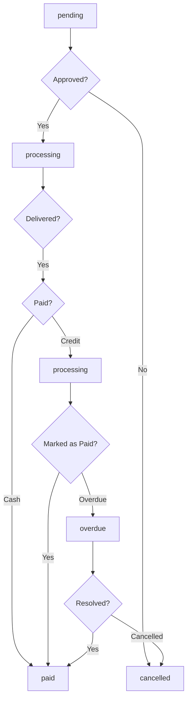
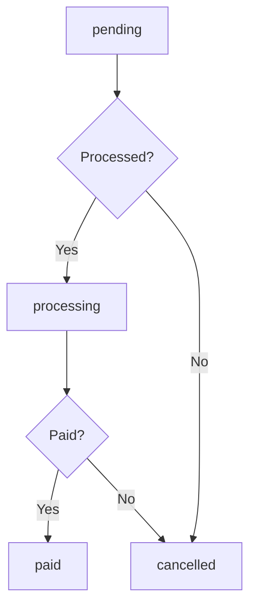

# Agrovet Purchase Status Workflow

## Overview
This document defines the status values and transition workflows for agrovet purchases in the enhanced credit system.

## Agrovet Purchase Status Values

### 1. pending
- **Description**: Initial status when a purchase is created but not yet processed
- **Use Case**: When a farmer requests a product but it hasn't been fulfilled yet
- **System Action**: Purchase is queued for fulfillment

### 2. processing
- **Description**: Purchase is being processed and prepared for delivery/pickup
- **Use Case**: Agrovet staff is preparing the items for the farmer
- **System Action**: Inventory is reserved, preparation in progress

### 3. paid
- **Description**: Purchase has been fully paid and completed
- **Use Case**: Farmer has either paid in cash or credit has been settled
- **System Action**: Inventory is reduced, transaction is complete

### 4. overdue
- **Description**: Purchase payment is overdue and requires attention
- **Use Case**: Credit purchase that has not been repaid within the agreed timeframe
- **System Action**: Alerts generated, collection processes initiated

### 5. cancelled
- **Description**: Purchase was cancelled and should not be processed
- **Use Case**: Farmer cancelled the request or staff determined it cannot be fulfilled
- **System Action**: Inventory is released, no financial impact

## Status Transition Workflows

### Credit Purchase Workflow

### Cash Purchase Workflow

## Business Rules

### 1. Inventory Management
- `pending` and `processing` statuses reserve inventory
- `paid` and `cancelled` statuses release inventory commitment
- `overdue` status does not affect inventory reservation

### 2. Financial Tracking
- Only `processing` and `overdue` purchases with credit payment method affect pending deductions
- `paid` purchases are excluded from pending deductions calculation
- `cancelled` purchases are removed from all financial calculations

### 3. Reporting
- All statuses are tracked for analytics and reporting
- Special attention to `overdue` purchases for collection tracking

## Integration Points

### With Credit Transactions
- Each agrovet purchase with credit payment links to a credit transaction
- When purchase status changes to `paid`, the linked credit transaction should also transition to `paid`
- When purchase becomes `overdue`, alerts should be generated for both systems

### With Farmer Credit Profile
- `processing` purchases with credit payment contribute to pending_deductions
- `paid` purchases are excluded from pending_deductions
- `overdue` purchases may trigger account freezing or other risk management actions

## Special Cases

### Partial Payments
- For purchases with partial payments, status remains `processing` until fully paid
- System tracks partial payment amounts separately

### Disputes
- If a purchase is disputed, it should be temporarily moved to a special status or flagged
- Resolution process determines final status (`paid`, `cancelled`, or back to `processing`)

### Returns/Refunds
- Returned items should transition to a special `returned` status
- Refunds should create reverse transactions in the credit system