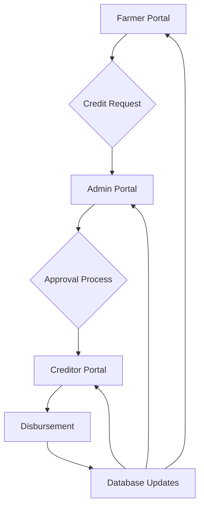

# Credit System Workflow and Data Flow Documentation

## Overview
This document describes the end-to-end workflow and data flow for the credit system across the farmer portal, admin portal, and creditor portal.

## System Architecture

### Components
1. **Farmer Portal** - Farmers request and use credit
2. **Admin Portal** - Administrators manage credit policies and approve requests
3. **Creditor Portal** - Agrovet staff manage credit disbursement and tracking
4. **Database Layer** - Supabase database with credit-related tables

### Key Entities
- `farmer_credit_profiles` - Farmer credit information
- `credit_requests` - Credit requests from farmers
- `credit_transactions` - All credit-related transactions
- `collections` - Milk collection payments (source of credit eligibility)
- `farmers` - Farmer profile information

## Workflow Overview



## Detailed Workflows

### 1. Farmer Credit Request Flow

#### Step 1: Farmer Checks Credit Eligibility
- Farmer logs into farmer portal
- System calculates credit eligibility based on:
  - Farmer tier (new, established, premium)
  - Pending milk collections
  - Existing credit balance
  - Account status (frozen/unfrozen)
- Farmer views available credit on dashboard

#### Step 2: Farmer Submits Credit Request
- Farmer navigates to "Shop with Credit" section
- Farmer selects products and quantities
- System validates request against available credit
- Farmer submits credit request
- Request is saved with status "pending"

#### Step 3: Request Processing
- Request appears in admin portal approval queue
- Request appears in creditor portal for tracking
- Admin reviews and approves/rejects request
- If approved, farmer's credit balance is updated
- Creditor is notified of approval

#### Step 4: Credit Disbursement
- Creditor views approved request in portal
- Creditor disburses product to farmer
- Transaction is recorded in system
- Farmer's available credit is reduced

### 2. Credit Granting Flow

#### Step 1: Admin Reviews Farmer Profile
- Admin views farmer credit management dashboard
- Admin can see all farmers and their credit status
- Admin identifies farmers eligible for credit granting

#### Step 2: Credit Granting Process
- Admin selects farmer to grant credit
- System calculates eligible credit amount based on:
  - Pending collections
  - Farmer tier percentage
  - Maximum credit limit
- Admin confirms credit granting
- Farmer's available credit balance is updated
- Transaction is recorded

#### Step 3: Farmer Notification
- Farmer receives notification of credit grant
- Farmer can view updated credit balance in portal
- Farmer can now submit credit requests

### 3. Credit Usage Flow

#### Step 1: Farmer Uses Credit
- Farmer makes agrovet purchase using credit
- System validates available credit balance
- Credit balance is reduced by purchase amount
- Transaction is recorded

#### Step 2: Transaction Recording
- Transaction appears in all portals in real-time
- Admin can view usage in analytics
- Creditor can track disbursements
- Farmer can see transaction history

### 4. Credit Repayment Flow

#### Step 1: Milk Collection Payment
- Farmer makes milk collection
- System automatically applies credit repayment
- Credit balance is restored by payment amount
- Transaction is recorded

#### Step 2: Balance Restoration
- Farmer's available credit increases
- Total credit used decreases
- Pending deductions are processed
- All portals show updated balances

## Data Flow Between Portals

### Farmer Portal Data Access
- Reads: Farmer profile, credit profile, credit transactions, credit requests
- Writes: Credit requests, shopping cart items
- Real-time: Credit balance updates

### Admin Portal Data Access
- Reads: All farmer profiles, credit profiles, credit requests, transactions
- Writes: Credit profile updates, request approvals/rejections, credit grants
- Real-time: Analytics data, notifications

### Creditor Portal Data Access
- Reads: Credit requests, farmer profiles, credit profiles, transaction history
- Writes: Request disbursement status, notes
- Real-time: Request status updates, notifications

### Database Schema

#### farmer_credit_profiles
```sql
CREATE TABLE IF NOT EXISTS public.farmer_credit_profiles (
    id UUID PRIMARY KEY DEFAULT gen_random_uuid(),
    farmer_id UUID NOT NULL REFERENCES public.farmers(id) ON DELETE CASCADE,
    credit_tier TEXT DEFAULT 'new' CHECK (credit_tier IN ('new', 'established', 'premium')),
    credit_limit_percentage DECIMAL(5,2) NOT NULL DEFAULT 30.00,
    max_credit_amount DECIMAL(10,2) DEFAULT 100000.00,
    current_credit_balance DECIMAL(10,2) DEFAULT 0.00,
    total_credit_used DECIMAL(10,2) DEFAULT 0.00,
    pending_deductions DECIMAL(10,2) DEFAULT 0.00,
    last_settlement_date DATE,
    next_settlement_date DATE,
    is_frozen BOOLEAN DEFAULT false,
    freeze_reason TEXT,
    created_at TIMESTAMPTZ DEFAULT NOW(),
    updated_at TIMESTAMPTZ DEFAULT NOW()
);
```

#### credit_requests
```sql
CREATE TABLE IF NOT EXISTS public.credit_requests (
    id UUID PRIMARY KEY DEFAULT gen_random_uuid(),
    farmer_id UUID NOT NULL REFERENCES public.farmers(id) ON DELETE CASCADE,
    product_id UUID,
    product_name TEXT NOT NULL,
    quantity INTEGER NOT NULL,
    unit_price DECIMAL(10,2) NOT NULL,
    total_amount DECIMAL(10,2) NOT NULL,
    status TEXT NOT NULL CHECK (status IN ('pending', 'approved', 'rejected', 'disbursed')),
    notes TEXT,
    available_credit_at_request DECIMAL(10,2),
    processed_by UUID REFERENCES public.agrovet_staff(id),
    processed_at TIMESTAMPTZ,
    rejection_reason TEXT,
    created_at TIMESTAMPTZ DEFAULT NOW(),
    updated_at TIMESTAMPTZ DEFAULT NOW()
);
```

#### credit_transactions
```sql
CREATE TABLE IF NOT EXISTS public.credit_transactions (
    id UUID PRIMARY KEY DEFAULT gen_random_uuid(),
    farmer_id UUID NOT NULL REFERENCES public.farmers(id) ON DELETE CASCADE,
    transaction_type TEXT NOT NULL CHECK (transaction_type IN ('credit_granted', 'credit_used', 'credit_repaid', 'credit_adjusted', 'settlement')),
    amount DECIMAL(10,2) NOT NULL,
    balance_before DECIMAL(10,2) NOT NULL,
    balance_after DECIMAL(10,2) NOT NULL,
    product_id UUID,
    product_name TEXT,
    quantity INTEGER,
    unit_price DECIMAL(10,2),
    reference_id UUID,
    description TEXT,
    approved_by UUID,
    approval_status TEXT CHECK (approval_status IN ('pending', 'approved', 'rejected')),
    created_at TIMESTAMPTZ DEFAULT NOW()
);
```

## Data Consistency Mechanisms

### Real-time Updates
- All portals use Supabase real-time subscriptions
- Credit balance changes propagate immediately
- Request status updates appear in real-time
- Transaction history syncs across portals

### Validation Layers
- Database constraints prevent invalid data
- Application-level validation ensures business rules
- Service layer validation prevents inconsistent states

### Error Handling
- Failed transactions are logged and retried
- User-facing errors are informative but secure
- System maintains audit trail of all operations

## Security Considerations

### Role-Based Access Control
- Farmers can only view their own data
- Admins can view and modify all credit data
- Creditors can view requests and update disbursement status

### Data Protection
- Sensitive financial data is encrypted at rest
- All data transfers use HTTPS
- Authentication is required for all portal access

### Audit Trail
- All credit transactions are logged
- Changes to credit profiles are tracked
- User actions are associated with timestamps and user IDs

## Performance Considerations

### Caching Strategy
- Farmer credit profiles are cached for quick access
- Analytics data is precomputed for dashboards
- Frequently accessed data is optimized

### Database Indexing
- Credit profiles indexed by farmer_id
- Requests indexed by farmer_id and status
- Transactions indexed by farmer_id and created_at

### Load Management
- Pagination for large data sets
- Efficient queries with proper filtering
- Background processing for non-critical operations