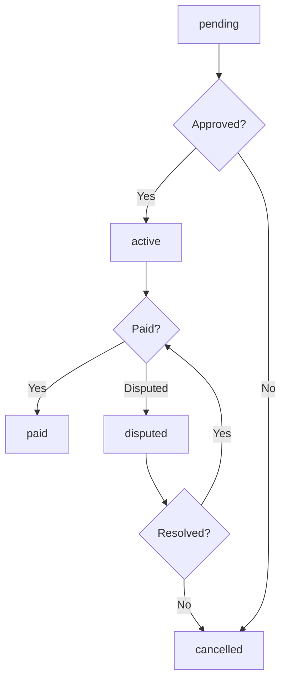
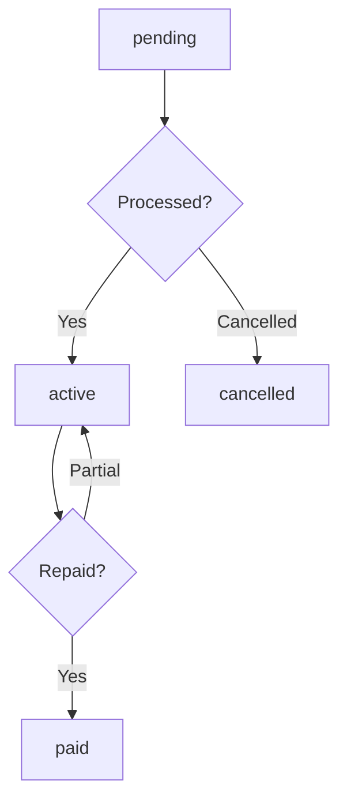

# Credit Transaction Status Workflow

## Overview
This document defines the status values and transition workflows for credit transactions in the enhanced credit system.

## Credit Transaction Status Values

### 1. pending
- **Description**: Initial status when a credit transaction is created but not yet processed
- **Use Case**: When a farmer requests credit but it hasn't been approved yet
- **System Action**: Transaction is queued for processing

### 2. active
- **Description**: Transaction is active and being tracked for payment
- **Use Case**: Credit has been approved and is awaiting repayment through milk collections
- **System Action**: Included in pending deductions calculation

### 3. paid
- **Description**: Transaction has been fully paid/reconciled
- **Use Case**: Credit has been repaid through milk collection payments
- **System Action**: Excluded from pending deductions calculation, marked as complete

### 4. cancelled
- **Description**: Transaction was cancelled and should not be processed
- **Use Case**: Credit request was cancelled by farmer or rejected by admin
- **System Action**: Removed from all calculations and tracking

### 5. disputed
- **Description**: Transaction is under dispute and requires resolution
- **Use Case**: Farmer or admin has raised concerns about the transaction
- **System Action**: Temporarily excluded from calculations until resolved

## Status Transition Workflows

### Standard Credit Usage Workflow

### Credit Granting Workflow

## Business Rules

### 1. Pending Deductions Calculation
- Only transactions with status `active` are included in pending deductions
- Transactions with status `paid`, `cancelled`, or `disputed` are excluded

### 2. Credit Availability Calculation
- Only `paid` transactions affect the farmer's available credit balance
- `active` transactions represent obligations that reduce available credit

### 3. Reporting
- All statuses are tracked for analytics and reporting
- Special attention to `disputed` transactions for resolution tracking

## Integration Points

### With Agrovet Purchases
- When a credit transaction is created for an agrovet purchase, it starts as `pending`
- Upon approval, it transitions to `active`
- When marked as paid through the "mark as paid" functionality, it transitions to `paid`

### With Farmer Credit Profile
- `active` transactions contribute to the farmer's pending_deductions
- `paid` transactions are excluded from pending_deductions
- `cancelled` transactions are removed from all calculations