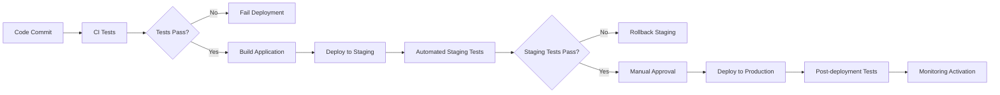

# Farmer Registration System - Deployment and Monitoring Plan

## 1. Deployment Strategy

### 1.1 Environment Setup
- **Development**: Local development environment
- **Staging**: Test environment mirroring production
- **Production**: Live environment serving real users

### 1.2 Deployment Pipeline


### 1.3 Database Migration Strategy
1. **Pre-deployment**:
   - Backup production database
   - Verify migration scripts
   - Test migrations on staging environment

2. **Deployment**:
   - Run migrations in specific order:
     1. `20251010000100_farmer_registration_schema_fixes.sql`
     2. `20251010000200_farmer_approval_functions.sql`
     3. `20251010000300_storage_enhancements.sql`
     4. `20251010000400_email_notification_system.sql`

3. **Post-deployment**:
   - Verify schema changes
   - Test all database functions
   - Monitor for any migration-related issues

### 1.4 Frontend Deployment
- **Build Process**: 
  - Run `npm run build` to create production build
  - Optimize assets and bundle size
  - Generate source maps for debugging

- **Deployment Targets**:
  - Vercel for frontend hosting
  - CDN for static assets
  - Supabase for backend services

### 1.5 Rollback Plan
1. **Database Rollback**:
   - Execute down migration scripts in reverse order
   - Restore database from backup if needed

2. **Frontend Rollback**:
   - Revert to previous deployment using Vercel rollback
   - Monitor for any issues after rollback

## 2. Monitoring Strategy

### 2.1 Application Performance Monitoring (APM)
- **Response Time Monitoring**:
  - Track API endpoint response times
  - Set alerts for >500ms response times
  - Monitor database query performance

- **Error Rate Monitoring**:
  - Track 5xx errors
  - Set alerts for >1% error rate
  - Monitor specific error patterns

### 2.2 Database Monitoring
- **Query Performance**:
  - Monitor slow queries (>100ms)
  - Track database connection pool usage
  - Monitor index usage and effectiveness

- **Storage Monitoring**:
  - Track storage usage in kyc-documents bucket
  - Monitor failed upload attempts
  - Track document cleanup job performance

### 2.3 Business Metrics Monitoring
- **Registration Metrics**:
  - Track daily registration attempts
  - Monitor approval/rejection rates
  - Track resubmission rates

- **Email Delivery Metrics**:
  - Track email queue processing rate
  - Monitor failed email deliveries
  - Track email open/click rates

### 2.4 Security Monitoring
- **Authentication Monitoring**:
  - Track failed login attempts
  - Monitor suspicious IP addresses
  - Alert on brute force attempts

- **Authorization Monitoring**:
  - Track unauthorized access attempts
  - Monitor permission violations
  - Alert on privilege escalation attempts

### 2.5 Infrastructure Monitoring
- **Supabase Monitoring**:
  - Track database CPU and memory usage
  - Monitor storage usage
  - Track API request rates

- **Frontend Monitoring**:
  - Track page load times
  - Monitor JavaScript errors
  - Track user engagement metrics

## 3. Alerting System

### 3.1 Critical Alerts (Page Immediately)
- Database downtime
- Authentication system failure
- Email queue processing failure
- Storage bucket quota exceeded

### 3.2 Warning Alerts (Email/SMS)
- High error rates (>5%)
- Slow response times (>1s)
- Storage usage >80%
- Email delivery failures >10%

### 3.3 Info Alerts (Logging)
- New farmer registrations
- Approval/rejection actions
- System maintenance events

## 4. Logging Strategy

### 4.1 Log Levels
- **ERROR**: System errors requiring immediate attention
- **WARN**: Potential issues that may require investigation
- **INFO**: Normal operational events
- **DEBUG**: Detailed information for troubleshooting

### 4.2 Log Structure
```json
{
  "timestamp": "2025-10-10T10:30:00Z",
  "level": "INFO",
  "service": "farmer-registration",
  "action": "farmer_approved",
  "userId": "user-123",
  "farmerId": "farmer-456",
  "ipAddress": "192.168.1.1",
  "userAgent": "Mozilla/5.0...",
  "metadata": {
    "adminId": "admin-789",
    "processingTime": 150
  }
}
```

### 4.3 Log Retention
- **ERROR/WARN**: 90 days
- **INFO**: 30 days
- **DEBUG**: 7 days

## 5. Backup and Disaster Recovery

### 5.1 Database Backups
- **Frequency**: Daily full backups
- **Retention**: 30 days of backups
- **Storage**: Encrypted cloud storage
- **Testing**: Monthly restore tests

### 5.2 Document Storage Backups
- **Frequency**: Weekly backups of kyc-documents bucket
- **Retention**: 90 days of backups
- **Storage**: Separate cloud storage account

### 5.3 Recovery Procedures
1. **Database Recovery**:
   - Restore from latest backup
   - Apply transaction logs if needed
   - Verify data integrity

2. **Document Recovery**:
   - Restore from bucket backup
   - Verify document integrity
   - Update references if needed

## 6. Performance Baselines

### 6.1 Response Time Targets
- **API Endpoints**: <200ms average
- **Database Queries**: <100ms average
- **Page Load**: <2s for main pages
- **Document Upload**: <5s for 5MB files

### 6.2 Throughput Targets
- **Registrations**: 100 concurrent users
- **Approvals**: 50 concurrent admin actions
- **Email Processing**: 1000 emails per hour
- **Document Uploads**: 20 concurrent uploads

### 6.3 Availability Targets
- **Uptime**: 99.9% monthly
- **Database**: 99.95% monthly
- **Storage**: 99.9% monthly

## 7. Maintenance Windows

### 7.1 Scheduled Maintenance
- **Frequency**: Monthly
- **Duration**: 2 hours
- **Time**: Saturday 2:00 AM - 4:00 AM EAT
- **Activities**:
  - Database optimization
  - Index rebuilding
  - Log cleanup
  - Security updates

### 7.2 Emergency Maintenance
- **Trigger**: Critical security issues
- **Notification**: 4 hours advance notice when possible
- **Duration**: As needed
- **Activities**:
  - Security patches
  - Critical bug fixes
  - Infrastructure updates

## 8. Post-Deployment Validation

### 8.1 Smoke Tests
1. **Farmer Registration**:
   - Complete registration flow
   - Upload KYC documents
   - Submit for review

2. **Admin Approval**:
   - View pending farmers
   - Approve farmer application
   - Receive confirmation email

3. **Email Notifications**:
   - Verify email templates
   - Test queue processing
   - Check rate limiting

### 8.2 Performance Tests
1. **Load Testing**:
   - 100 concurrent registrations
   - 50 concurrent approvals
   - Monitor response times

2. **Stress Testing**:
   - 500 concurrent users
   - Monitor system stability
   - Check resource utilization

### 8.3 Security Tests
1. **Penetration Testing**:
   - Test authentication bypass
   - Test authorization escalation
   - Verify input validation

2. **Compliance Checks**:
   - Verify data encryption
   - Check access logs
   - Validate privacy controls

## 9. Documentation and Knowledge Transfer

### 9.1 Operational Documentation
- Deployment procedures
- Monitoring dashboards
- Incident response procedures
- Troubleshooting guides

### 9.2 Training Materials
- Admin user guides
- Farmer user guides
- Technical documentation
- API documentation

### 9.3 Knowledge Transfer
- Team training sessions
- Shadow operations
- Documentation review
- Q&A sessions

## 10. Continuous Improvement

### 10.1 Regular Reviews
- **Weekly**: Performance metrics review
- **Monthly**: System health assessment
- **Quarterly**: Architecture review
- **Annually**: Technology refresh planning

### 10.2 Feedback Loops
- User feedback collection
- Performance monitoring trends
- Security audit results
- Incident post-mortems

### 10.3 Optimization Opportunities
- Database query optimization
- Frontend performance improvements
- Email delivery optimization
- Storage cost reduction