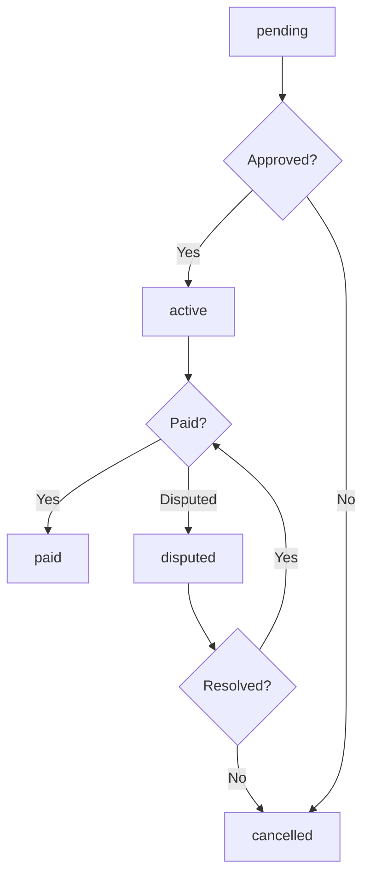
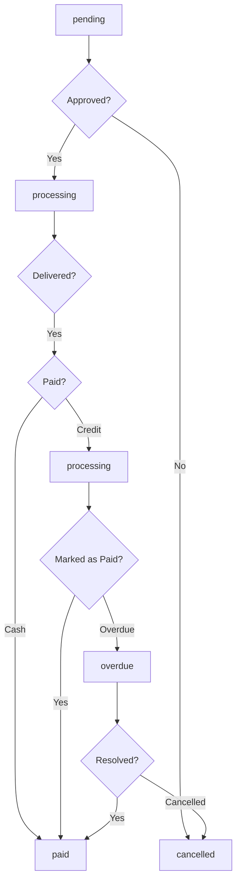

# Enhanced Credit System User Guide

## Overview

This document provides a comprehensive guide to the enhanced credit system with status tracking functionality. The system now includes detailed status tracking for both credit transactions and agrovet purchases, allowing for better monitoring and management of farmer credit activities.

## Credit Transaction Status Tracking

### Status Values

1. **pending** - Initial status when a credit transaction is created but not yet processed
2. **active** - Transaction is active and being tracked for payment
3. **paid** - Transaction has been fully paid/reconciled
4. **cancelled** - Transaction was cancelled and should not be processed
5. **disputed** - Transaction is under dispute and requires resolution

### Status Transitions

### Business Rules

- Only transactions with status `active` are included in pending deductions
- Transactions with status `paid`, `cancelled`, or `disputed` are excluded from pending deductions
- When a transaction is marked as `paid`, it is automatically excluded from pending deductions calculations

## Agrovet Purchase Payment Status Tracking

### Status Values

1. **pending** - Initial status when a purchase is created but not yet processed
2. **processing** - Purchase is being processed and prepared for delivery/pickup
3. **paid** - Purchase has been fully paid and completed
4. **overdue** - Purchase payment is overdue and requires attention
5. **cancelled** - Purchase was cancelled and should not be processed

### Status Transitions

### Business Rules

- Only `processing` and `overdue` purchases with credit payment method affect pending deductions
- `paid` purchases are excluded from pending deductions calculation
- `cancelled` purchases are removed from all financial calculations

## Dashboard Features

### Farmer Dashboard

Farmers can now view the status of their credit transactions and purchases directly in their dashboard:

1. **Credit Transactions Section** - Shows all credit transactions with status badges
2. **Purchase History Section** - Displays agrovet purchases with payment status indicators
3. **Status Filtering** - Allows farmers to filter transactions and purchases by status

### Admin Dashboard

Administrators have enhanced monitoring capabilities:

1. **Credit Management Section** - Comprehensive view of all farmer credit profiles
2. **Transaction Monitoring** - Real-time tracking of credit transaction statuses
3. **Purchase Tracking** - Monitoring of agrovet purchase payment statuses
4. **Status Filtering** - Advanced filtering options by transaction and payment status
5. **Reporting** - Enhanced analytics with status-based insights

### Creditor Dashboard

Creditors can efficiently manage product disbursement:

1. **Product Disbursement Section** - Track pending collections with status indicators
2. **Status Filtering** - Filter disbursement items by collection status
3. **Real-time Updates** - Instant status updates when collections are confirmed

## Key Functionalities

### Mark as Paid Feature

Farmers and administrators can mark credit transactions as paid:

1. **Single Transaction** - Mark individual transactions as paid
2. **Batch Processing** - Mark multiple transactions as paid simultaneously
3. **Automatic Deduction Update** - Pending deductions are automatically recalculated
4. **Status Synchronization** - Linked agrovet purchases are automatically updated

### Pending Deductions Management

The system automatically manages pending deductions based on transaction statuses:

1. **Active Transactions** - Included in pending deductions calculation
2. **Paid Transactions** - Excluded from pending deductions
3. **Cancelled Transactions** - Removed from all calculations
4. **Disputed Transactions** - Temporarily excluded until resolution

### Notifications

Users receive automatic notifications for status changes:

1. **Transaction Status Changes** - Notifications when credit transaction status changes
2. **Purchase Payment Status Changes** - Alerts when agrovet purchase payment status updates
3. **Payment Reminders** - Automatic reminders for upcoming payments
4. **Overdue Alerts** - Warnings for overdue payments

## Best Practices

### For Farmers

1. **Regular Monitoring** - Check your dashboard regularly for status updates
2. **Prompt Payments** - Make payments on time to avoid overdue status
3. **Dispute Resolution** - Contact support immediately if you notice discrepancies
4. **Status Filtering** - Use filters to focus on specific transaction types

### For Administrators

1. **Proactive Monitoring** - Regularly review status changes for potential issues
2. **Dispute Management** - Address disputed transactions promptly
3. **Overdue Management** - Follow up on overdue payments quickly
4. **Reporting** - Use status-based reports for better decision-making

### For Creditors

1. **Collection Confirmation** - Confirm collections promptly to update statuses
2. **Status Tracking** - Monitor pending collections to ensure timely processing
3. **Communication** - Coordinate with farmers for collection scheduling

## Troubleshooting

### Common Issues

1. **Status Not Updating** - Refresh the dashboard or contact support
2. **Incorrect Pending Deductions** - Verify transaction statuses and contact admin
3. **Missing Notifications** - Check notification settings and spam folders
4. **Filtering Problems** - Clear filters and try again

### Support Contacts

- **Technical Support**: support@cowconnect.com
- **Credit Department**: credit@cowconnect.com
- **General Inquiries**: info@cowconnect.com

## Glossary

- **Credit Transaction** - A record of credit usage or repayment
- **Agrovet Purchase** - A purchase of agricultural supplies using credit
- **Pending Deductions** - Amounts to be deducted from milk collection payments
- **Status** - Current state of a transaction or purchase in the workflow
- **Mark as Paid** - Manual action to indicate a transaction has been settled

## Version History

- **Version 1.0** - Initial enhanced credit system with status tracking
- **Release Date** - December 2025