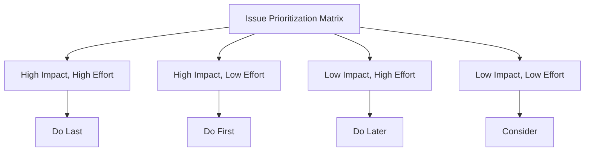

# Variance Reporting Dashboard Usability Testing Report

## Executive Summary

### Purpose
This report summarizes the findings from usability testing conducted on the enhanced Variance Reporting Dashboard to evaluate its effectiveness, efficiency, and user satisfaction.

### Methodology
- **Participants**: [Number] users with varying levels of experience
- **Duration**: [Testing period]
- **Scenarios Tested**: 4 key user scenarios
- **Data Collection Methods**: Observation, screen recording, surveys, interviews

### Key Findings
- [Brief summary of major findings]
- [Overall user satisfaction rating]
- [Task completion rate]

## Test Participants

| Participant ID | Role | Experience Level | Technical Background | Previous Dashboard Experience |
|----------------|------|------------------|---------------------|------------------------------|
| P001 | [Role] | [Level] | [Yes/No] | [Yes/No] |
| P002 | [Role] | [Level] | [Yes/No] | [Yes/No] |
| ... | ... | ... | ... | ... |

## Scenario Results

### Scenario 1: Daily Monitoring
**Success Rate**: [Percentage]%
**Average Completion Time**: [Time]
**Common Issues**:
- [Issue 1]
- [Issue 2]
- ...

**Participant Feedback**:
> "[Representative quote from participant]"

### Scenario 2: Performance Analysis
**Success Rate**: [Percentage]%
**Average Completion Time**: [Time]
**Common Issues**:
- [Issue 1]
- [Issue 2]
- ...

**Participant Feedback**:
> "[Representative quote from participant]"

### Scenario 3: Trend Investigation
**Success Rate**: [Percentage]%
**Average Completion Time**: [Time]
**Common Issues**:
- [Issue 1]
- [Issue 2]
- ...

**Participant Feedback**:
> "[Representative quote from participant]"

### Scenario 4: Data Export and Reporting
**Success Rate**: [Percentage]%
**Average Completion Time**: [Time]
**Common Issues**:
- [Issue 1]
- [Issue 2]
- ...

**Participant Feedback**:
> "[Representative quote from participant]"

## Quantitative Results

### Task Completion Rates
| Task | Success Rate | Average Time | Error Rate |
|------|--------------|--------------|------------|
| Task 1 | [Percentage]% | [Time] | [Percentage]% |
| Task 2 | [Percentage]% | [Time] | [Percentage]% |
| ... | ... | ... | ... |

### User Satisfaction Scores
| Metric | Score (1-5) | Comments |
|--------|-------------|----------|
| Ease of Use | [Score] | [Comments] |
| Visual Appeal | [Score] | [Comments] |
| Performance | [Score] | [Comments] |
| Overall Satisfaction | [Score] | [Comments] |

### System Usability Scale (SUS)
**Average SUS Score**: [Score]/100
**Grade**: [Letter Grade]
**Percentile Rank**: [Percentile]%

## Qualitative Feedback

### Positive Feedback
- "[Quote from participant about what they liked]"
- "[Another positive quote]"
- ...

### Constructive Criticism
- "[Quote from participant about areas for improvement]"
- "[Another suggestion]"
- ...

### Feature Requests
- "[Requested feature]"
- "[Another request]"
- ...

## Identified Issues

### Critical Issues (Prevent Task Completion)
| Issue ID | Description | Impact | Recommendation | Priority |
|----------|-------------|--------|----------------|----------|
| CRIT-001 | [Description] | [Impact] | [Solution] | High |
| ... | ... | ... | ... | ... |

### Major Issues (Significant Difficulty)
| Issue ID | Description | Impact | Recommendation | Priority |
|----------|-------------|--------|----------------|----------|
| MAJ-001 | [Description] | [Impact] | [Solution] | Medium |
| ... | ... | ... | ... | ... |

### Minor Issues (Slight Inconvenience)
| Issue ID | Description | Impact | Recommendation | Priority |
|----------|-------------|--------|----------------|----------|
| MIN-001 | [Description] | [Impact] | [Solution] | Low |
| ... | ... | ... | ... | ... |

## Priority Matrix

## Recommendations

### Immediate Actions (Next Release)
1. [Action item with priority and estimated effort]
2. ...

### Short-term Improvements (Within 3 Months)
1. [Action item with priority and estimated effort]
2. ...

### Long-term Enhancements (Future Roadmap)
1. [Action item with priority and estimated effort]
2. ...

## Accessibility Assessment

### WCAG 2.1 Compliance
| Criterion | Status | Notes |
|-----------|--------|-------|
| 1.1.1 Non-text Content | [Pass/Fail] | [Notes] |
| 1.3.1 Info and Relationships | [Pass/Fail] | [Notes] |
| 1.4.3 Contrast (Minimum) | [Pass/Fail] | [Notes] |
| 2.1.1 Keyboard | [Pass/Fail] | [Notes] |
| ... | ... | ... |

### Screen Reader Compatibility
- [Status and notes]

### Keyboard Navigation
- [Status and notes]

## Performance Evaluation

### Load Times
| Page/Component | Average Load Time | Threshold | Status |
|----------------|-------------------|-----------|--------|
| Dashboard Initial Load | [Time] | [Threshold] | [Pass/Fail] |
| Chart Rendering | [Time] | [Threshold] | [Pass/Fail] |
| Data Export | [Time] | [Threshold] | [Pass/Fail] |
| ... | ... | ... | ... |

### Browser Compatibility
| Browser | Version | Status | Notes |
|---------|---------|--------|-------|
| Chrome | [Version] | [Pass/Fail] | [Notes] |
| Firefox | [Version] | [Pass/Fail] | [Notes] |
| Safari | [Version] | [Pass/Fail] | [Notes] |
| Edge | [Version] | [Pass/Fail] | [Notes] |

## Conclusion

### Overall Assessment
[Summary of the dashboard's usability and user experience]

### Success Metrics Achievement
- Task Completion Rate: [Actual]/[Target]
- SUS Score: [Actual]/[Target]
- Critical Issues: [Actual]/[Target]
- User Satisfaction: [Actual]/[Target]

### Next Steps
1. [Immediate action based on findings]
2. [Follow-up activities]
3. [Future testing plans]

## Appendices

### Appendix A: Survey Questions
[Full list of survey questions used]

### Appendix B: Interview Guide
[Structured interview questions]

### Appendix C: Raw Data
[Link to raw data files if applicable]

### Appendix D: Screen Recordings
[Information about recorded sessions]

### Appendix E: Participant Consent Forms
[Sample consent form used]