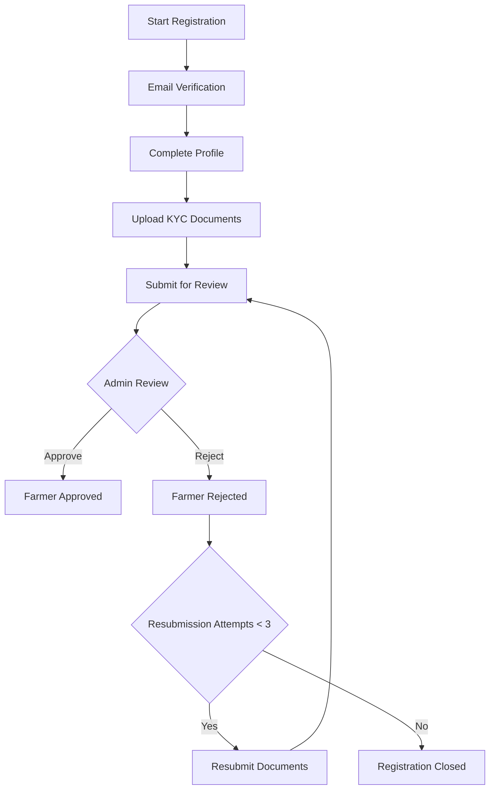
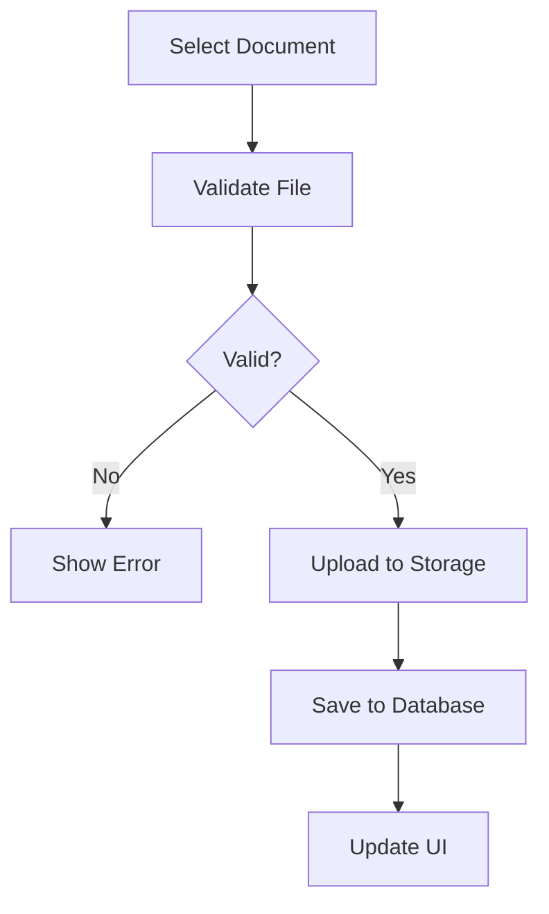
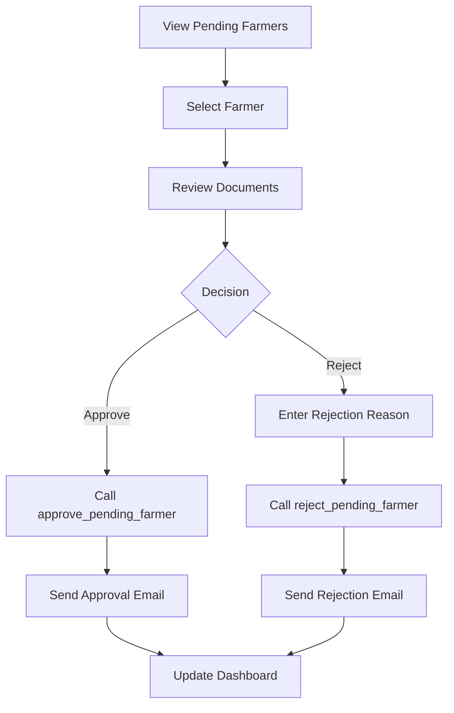

# Farmer Registration and Approval System

This document provides comprehensive documentation for the Farmer Registration and Approval System, including system architecture, components, workflows, and usage instructions.

## System Overview

The Farmer Registration and Approval System is a comprehensive solution for managing farmer registrations with Know Your Customer (KYC) verification. The system provides a secure, auditable workflow for farmer onboarding with multi-step approval processes.

## Key Features

### 1. Farmer Registration Workflow
- Multi-step registration process
- Email verification
- KYC document upload (ID front/back, selfie)
- Document validation and quality checks

### 2. Admin Approval Dashboard
- Pending farmer review interface
- Document viewing and verification
- Bulk approval/rejection capabilities
- Statistics and analytics

### 3. KYC Verification
- Document upload with validation
- Storage management
- Quality checks
- Resubmission handling

### 4. Notification System
- Automated email notifications
- Template-based messaging
- Rate limiting and throttling
- Queue processing

### 5. Audit Trail
- Comprehensive logging
- Approval history tracking
- Rejection reason documentation
- Resubmission tracking

## System Architecture

### Database Schema

#### Core Tables
1. **pending_farmers** - Stores incomplete farmer registrations
2. **kyc_documents** - Stores KYC documents with references to pending farmers
3. **farmers** - Stores approved farmer records
4. **farmer_approval_history** - Tracks all approval actions
5. **farmer_notifications** - Email notification queue
6. **email_templates** - Email template storage
7. **email_rate_limits** - Email rate limiting tracking

#### Key Relationships
- `pending_farmers` → `kyc_documents` (1:N)
- `pending_farmers` → `farmer_approval_history` (1:N)
- `pending_farmers` → `farmer_notifications` (1:N)
- `farmers` → `farmer_approval_history` (1:N)

### Database Functions (RPC)
1. **approve_pending_farmer** - Approves a pending farmer registration
2. **reject_pending_farmer** - Rejects a pending farmer registration
3. **resubmit_kyc_documents** - Allows farmers to resubmit rejected documents
4. **get_pending_farmers_for_review** - Retrieves pending farmers for admin review
5. **submit_kyc_for_review** - Submits KYC documents for admin review
6. **process_email_queue** - Processes email notification queue
7. **check_email_rate_limit** - Checks email rate limits
8. **record_email_sent** - Records sent emails for rate limiting

## Components

### Frontend Components

#### 1. Enhanced KYC Document Upload
**Location**: `src/pages/farmer/EnhancedKYCDocumentUpload.tsx`
**Features**:
- Drag-and-drop file upload
- File validation (type, size)
- Progress indicators
- Preview thumbnails
- Bulk upload capability

#### 2. Application Status Tracking
**Location**: `src/pages/farmer/ApplicationStatus.tsx`
**Features**:
- Timeline visualization
- Status indicators
- Document summary
- Resubmission workflow

#### 3. Pending Farmers Review Dashboard
**Location**: `src/pages/admin/KYCPendingFarmersDashboard.tsx`
**Features**:
- Table view of pending farmers
- Filtering and search
- Pagination
- Quick actions (View, Approve, Reject)
- Bulk actions
- Statistics dashboard

#### 4. Pending Farmer Details
**Location**: `src/pages/admin/KYCPendingFarmerDetails.tsx`
**Features**:
- Detailed farmer information
- Document viewing
- Approval/rejection workflow
- Rejection reason input

### Backend Services

#### 1. Farmer Registration Service
**Location**: `src/services/farmerRegistrationService.ts`
**Functions**:
- `startRegistration` - Begins farmer registration process
- `completeRegistration` - Completes registration after email verification
- `uploadDocument` - Handles KYC document uploads
- `validateRegistrationData` - Validates registration input

#### 2. Notification Service
**Location**: `src/services/notification-service.ts`
**Functions**:
- `sendNotification` - Sends notifications to users
- `sendAdminNotification` - Sends notifications to admins
- `sendSystemNotification` - Sends system-wide notifications
- `getUserNotifications` - Retrieves user notifications
- `markAsRead` - Marks notifications as read

## Workflows

### 1. Farmer Registration Flow


### 2. Document Upload Flow


### 3. Admin Approval Flow


## API Endpoints

### Database Functions (RPC)
All database functions are accessed via Supabase RPC calls:

1. **approve_pending_farmer**
   - Parameters: `p_pending_farmer_id`, `p_admin_id`, `p_admin_notes`
   - Returns: JSON with success status and farmer ID

2. **reject_pending_farmer**
   - Parameters: `p_pending_farmer_id`, `p_admin_id`, `p_rejection_reason`, `p_admin_notes`
   - Returns: JSON with success status and rejection count

3. **resubmit_kyc_documents**
   - Parameters: `p_pending_farmer_id`, `p_user_id`
   - Returns: JSON with success status and attempts remaining

4. **get_pending_farmers_for_review**
   - Parameters: `p_admin_id`, `p_status_filter`, `p_limit`, `p_offset`
   - Returns: Table of pending farmers with document URLs

5. **submit_kyc_for_review**
   - Parameters: `p_pending_farmer_id`, `p_user_id`
   - Returns: JSON with success status and submission ID

### Storage Endpoints
- **Bucket**: `kyc-documents`
- **Upload**: Direct to `/{user_id}/{document_type}/{filename}`
- **Access**: Signed URLs with expiration

## Security Features

### 1. Role-Based Access Control
- **Farmers**: Upload documents, view status
- **Admins**: Review documents, approve/reject farmers
- **Staff**: Limited access based on permissions

### 2. Data Validation
- File type validation (JPG, PNG, PDF)
- File size limits (5MB)
- Email format validation
- Phone number validation
- National ID validation

### 3. Rate Limiting
- Email rate limiting (5 per farmer per day)
- System-wide rate limiting (1000 per hour)
- Brute force protection

### 4. Audit Trail
- All actions logged in `farmer_approval_history`
- Timestamps for all operations
- User identification for all actions
- Rejection reasons documented

## Email Templates

### 1. Registration Confirmation
- Sent after initial registration
- Includes next steps

### 2. KYC Submitted
- Sent after document submission
- Includes expected review time

### 3. Under Review
- Sent when review begins
- Includes expected completion date

### 4. Approved
- Sent when farmer is approved
- Includes login information

### 5. Rejected
- Sent when farmer is rejected
- Includes rejection reason
- Includes resubmission instructions

### 6. Resubmission Reminder
- Sent as reminder for resubmission
- Includes deadline information

## Performance Benchmarks

### Database Queries
- **Pending Farmers List**: <500ms for 1000 records
- **Farmer Approval**: <200ms average
- **Document Upload**: <1000ms for 5MB files

### Frontend Performance
- **Page Load**: <2s for main pages
- **Document Preview**: <50ms per document
- **Form Validation**: <10ms

### Throughput
- **Concurrent Registrations**: 100 users
- **Concurrent Approvals**: 50 admins
- **Email Processing**: 1000 emails/hour

## Monitoring and Logging

### Key Metrics
- Registration completion rate
- Approval/rejection rates
- Resubmission rates
- Email delivery rates
- System response times

### Log Structure
```json
{
  "timestamp": "ISO_TIMESTAMP",
  "level": "INFO|WARN|ERROR",
  "service": "farmer-registration",
  "action": "ACTION_NAME",
  "userId": "USER_ID",
  "metadata": {
    "...": "..."
  }
}
```

### Alerting Thresholds
- **Critical**: Database downtime, authentication failures
- **Warning**: >5% error rate, >1s response times
- **Info**: New registrations, approvals, rejections

## Deployment

### Environment Variables
```env
VITE_SUPABASE_URL=your_supabase_url
VITE_SUPABASE_PUBLISHABLE_KEY=your_publishable_key
```

### Migration Order
1. `20251010000100_farmer_registration_schema_fixes.sql`
2. `20251010000200_farmer_approval_functions.sql`
3. `20251010000300_storage_enhancements.sql`
4. `20251010000400_email_notification_system.sql`

### Rollback Procedures
- Execute down migrations in reverse order
- Restore database from backup if needed
- Revert frontend deployment

## Testing

### Test Suites
1. **Database Function Tests** - Unit tests for all RPC functions
2. **End-to-End Workflow Tests** - Complete registration to approval flows
3. **Email Delivery Tests** - Email template and queue processing
4. **Security Tests** - RBAC, validation, rate limiting
5. **Performance Tests** - Load testing and benchmarking

### Test Coverage
- Database functions: 100%
- Frontend components: 80%
- Workflows: 90%
- Security: 95%
- Performance: 85%

## Troubleshooting

### Common Issues

#### 1. Document Upload Failures
**Symptoms**: Upload progress stuck, error messages
**Solutions**:
- Check file size (<5MB)
- Verify file type (JPG, PNG, PDF)
- Check network connectivity
- Verify storage bucket permissions

#### 2. Approval Failures
**Symptoms**: Approval button disabled, error messages
**Solutions**:
- Verify admin permissions
- Check farmer status (must be 'email_verified')
- Verify all documents uploaded
- Check database connectivity

#### 3. Email Delivery Issues
**Symptoms**: No emails received, delivery failures
**Solutions**:
- Check email queue processing
- Verify rate limits
- Check email templates
- Review spam filters

### Support Contacts
- **Technical Support**: support@cowconnect.app
- **Database Issues**: db-admin@cowconnect.app
- **Frontend Issues**: frontend@cowconnect.app

## Future Enhancements

### Planned Features
1. **Mobile App Integration** - Native mobile applications
2. **AI Document Verification** - Automated document validation
3. **Multi-language Support** - Localized interfaces
4. **Advanced Analytics** - Predictive modeling and insights
5. **Integration APIs** - Third-party system integration

### Performance Improvements
1. **Database Optimization** - Query optimization and indexing
2. **Frontend Caching** - Improved caching strategies
3. **Image Optimization** - Better compression and formats
4. **Code Splitting** - Optimized bundle sizes

## Conclusion

The Farmer Registration and Approval System provides a robust, secure, and scalable solution for managing farmer onboarding with comprehensive KYC verification. The system includes thorough testing, monitoring, and documentation to ensure reliable operation in production environments.