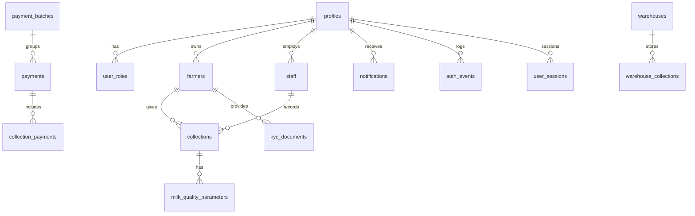

# Supabase Schema & Migration Documentation

This documentation summarizes the database schema, relationships, functions, triggers, policies, and migration strategy for the Cow Connect application.

## 1. High level ER (Mermaid)

## 2. Table summaries (selected)

- profiles: extension of auth.users (id uuid primary key). Columns: full_name, email, phone, metadata, created_at, updated_at, deleted_at, created_by, updated_by.
- user_roles: links profiles to roles (farmer, staff, admin). Columns: user_id, role, active, created_at.
- farmers: farmer-specific profile and KYC fields. Columns: id, user_id, registration_number, national_id, kyc_status, registration_completed, timestamps.
- staff: staff-specific record. Columns: id, user_id, employee_id, timestamps.
- collections: milk collection master record. Columns: id, collection_id, farmer_id, staff_id, liters, quality_grade, rate_per_liter, total_amount, gps, validation/verification codes, collection_date, status.
- milk_quality_parameters: detailed measurements attached to a collection.
- payments / payment_batches / collection_payments: payment processing tables.
- kyc_documents: storage of KYC files submitted by farmers.
- notifications: user notifications.
- farmer_analytics: cached analytics per farmer.
- audit_logs: universal audit log for tracked changes.
- system_settings: key/value for system config.

## 3. Naming & conventions
- snake_case for columns and tables.
- ENUM types for fixed values (kyc_status_enum, collection_status_enum, quality_grade_enum, payment_status_enum, batch_status_enum).
- All timestamps are timestamptz and default to now() (UTC).
- Soft deletes use deleted_at.
- created_by / updated_by (uuid) added where appropriate for audit.

## 4. Important RPCs (implemented in migrations/20240004_create_functions.sql)
- log_auth_event(p_user_id, p_event_type, p_metadata)
- check_account_lockout(p_email)
- reset_account_lockout(p_email)
- check_permission(p_user_id, p_permission)
- get_assigned_farmers(p_staff_id)
- record_milk_collection(...) -> inserts collection, returns id & validation code
- approve_kyc(farmer_id, admin_id)
- reject_kyc(farmer_id, reason, admin_id)

## 5. Triggers
- update_updated_at_column() used to automatically set updated_at on UPDATE (attached to many tables).
- audit_log_trigger() records INSERT/UPDATE/DELETE to audit_logs.
- notify_admin_new_registration() informs admins when a farmer with kyc_status = 'pending' is inserted.

## 6. RLS policies
- policies are in policies.sql. Key points:
  - profiles: users can SELECT/UPDATE their own; admins can SELECT all.
  - farmers: farmers only access own row; staff and admin can read many; updates restricted to owner or admin.
  - collections: farmers read own; staff read where staff_id matches; admin unrestricted.
  - payments: farmers can read their payments; insert/update reserved for admins / server.
  - notifications: users can read their notifications.

## 7. Migration files
Located in `supabase/migrations/` with sequential numbering. Apply in order.

## 8. Backups & Idempotency
- Each migration contains IF NOT EXISTS guards where appropriate. Rollbacks are documented in comments; for complex rollbacks run a manual plan (drop triggers, functions, then tables).

*** End Patch